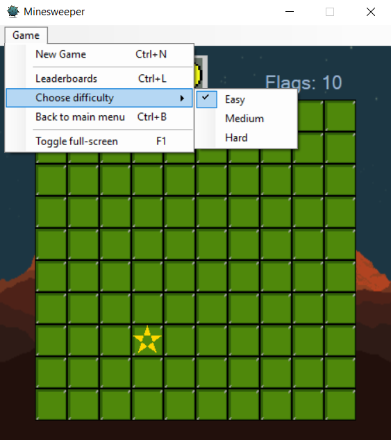
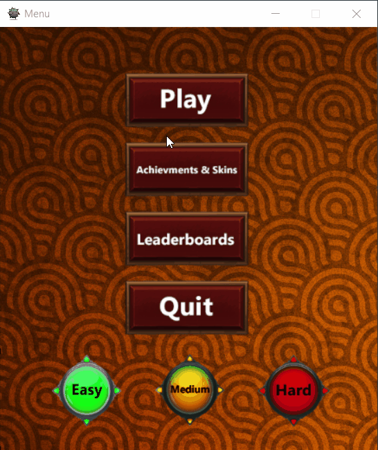

# Minesweeper
A fun implementation of the classic minesweeper game with additional features such as achievements, mine skins and a second chance spinning wheel! Download the [installer](https://github.com/markobogoevski/Minesweeper/raw/master/Installer/Debug/Installer.msi) and check it out yourself. You can read the full documentation in the following sections.
## Game description
Minesweeper is a single-player puzzle video game. The objective is to clear a rectangular cellboard without detonating any bombs in the process. The bombs are randomly placed in cells and the only indicator as to how to avoid them are numbers ranging from 1-8 placed on non-bomb tiles. The numbers give information about how many bombs are there in all of the adjacent cells of that tile (neighboring mines).
## Our implementation
We implemented every core functionality of the original Minesweeper game using our own design, algorithms and data structures, but since this is our implementation of it, we decided we'd like to offer more to the player besides the already known Minesweeper game.

Besides the basic functionalities:
- Core game logic
- In-game menu
- 3 Difficulties (easy, normal and hard), 

We've added a couple of extra functionalities including :
- Main menu used to access all of the forms (game, achievements, scoreboards), creating a bridge between all functionalities and a nice interface to the player.
- Boosted mode - this is a mode which triggers during gametime if the player manages to open 10 tiles without losing in a 10 second time interval. The mode enables the player to see all the bombs in the minefield for a short time duration - 3 seconds as a dynamic reward and catalyzer for the player's fast pace. Alternatively you can trigger the mode with the B key - for testing purposes. We decided to implement this mode because we thought it would offer greater dynamic gameplay and more interesting strategies revolving around competitive play and achieving record times. Starting at timestamp 00:00 , the player has 10 seconds to achieve the pace or the status resets. If the player managed to trigger the mode, upon ending, the 10 second time interval for another chance at the mode starts instantaneously.
- Hint tile - the hint tile is a small hint which triggers every 5 seconds of player inactivity - not cliking the left mouse button. The hint is displayed as a 5 pointed star hovering over some tile. The tile is guaranteed to be bomb-free. We've implemented this because of personal experience playing the original Minesweeper game. There are numerous times where you are stuck in a situation where there isn't enough information to help you decide which tile to click because of the random generator. So this is our way to counter that without crushing the point of the game.

{:class="img-responsive"}

- Second chance - second chance is a game mechanic that we implemented which focuses around the opportunity for the player to recieve a second life if he clicked on a bomb. The event appears at random game ends with 50% probability. Once triggered the event shows a roulette that the player can spin. Two out of six parts of the roulette have hearts on them. If the player manages to get either of them he gets a second life. The player can only get the second chance status **once** during one game. Alternatively, if the event is triggered the player can choose to cheat for a life for a guaranteed heart - for testing purposes. 
- Full-screen - the player can enter full-screen by pushing the F button and leave full-screen with the Esc button. Also, the player can toggle full-screen through the in-game menu and with the _F1_ key.
- Skins - this feature allows the player to change the appearance of the bomb in the game. There are seven skins in total - balloon, nuke, trap, shuriken, bomb, poison and the default mine. All skins except the default one are unlocked by finishing different difficulties of games in certain time limits. This is one way to reward the player for his good performance and encourage him to become a better and quicker player.
- Achievments - finishing the game within a time limit awards the player with an achievement. Each of the six achievements rewards a new skin and there are two achievements per game difficulty, one much easier to obtain than other. On easy difficulty in order to unlock an achievement the player needs to beat the game in less than 45 seconds or 15 seconds for the more difficult one, on medium - 4 minutes with 2 minutes and on hard - 10 minutes and 8 minutes.
- Leaderboards - the top scores of all players are shown in a leaderboards menu. Here the player can see all the top 10 scores for each difficulty. This menu uses serialization to make sure all scores are saved even after the player quits the game.
- Installer - this is an extra feature and it's purpose is to make the game available for everyone. It installs the `.exe` file and an _Assets_ folder, where the scoreboard and the achievements will be saved. The default folder is set to _Documents_, beacause that way the operating system won't stop the game from writing into the Assets folder, as it would if the game was located in the _Program files_ directory.

{:class="img-responsive"}

## Quick guide
The moment the application starts, the main menu appears with four main buttons and three options.


The player can choose one of the 3 options that represent the difficulty and upon clicking "Play" an instance of the game with the selected difficulty will be loaded. During gametime, the player can also interact with a mini menu on the top where he can choose to return to the main menu, see the leaderboards, start a new game or choose a new difficulty. Besides the menu, the player can also interact with the smiley button. If clicked the smiley restarts the game - shortcut for "New game". Left of the smiley is the timer which indicates the time spent playing the round and right is the number of flags left which the player can place to flag a field. The player uses the left mouse click to open a tile, and the right mouse click to toggle the tile's alternate states : flagged and question marked. A tile can be flagged only if it isn't at the moment, and can be question marked only if it is flagged, by right clicking it once more. If a tile is flagged it can't be clicked with the left mouse button. The question mark status is used to describe the player's uncertainty of a tile.

{:class="img-responsive"} {:class="img-responsive"}

When a player wins a game and his time is in the top 10, the _Name_ form appears. It is a simple windows form that has one textbox and one button and is used to create a _Score_ object, which then will be serialized. The textbox is where the player enters his name and pressing the "Enter" key or clicking the button will result in a successful instantiation of a _Score_ object, with the entered name, the time needed to win the game and the date when the game was played. However, if left blank, the textbox will cause an error message and will refuse to close this form. Serialization occurs in a `.lst` file (there is one file for each difficulty) inside the Assets folder.

{:class="img-responsive"}

Also, when the game is won, a check occurs to see whether the player's time meets the requirements of some locked achievement. In that case the achievement unlocks permanently and the player is notified. The achievements list is located in the Assets folder in the `achievements.lst` file, so when an unlock occurs the _Achievement_ object representing that unlocked achievement is updated and the list is again serialized in the same file.

{:class="img-responsive"}

When the player hits a mine, there is a 50% chance for the _Spinning wheel_ form to open. The spinning wheel (roulette) gives the player an opportunity to continue from the point of the game where he messed up. The wheel is equally divided in 6 parts, each containing either a heart (life) or one of the bomb skins (2 hearts, 4 bombs). By clicking the button "Spin" the wheel starts shifting the images to the right, from 4 to 15 times. A triangular indicator on top shows which "award" is about to be picked when the wheel stops turning. Clicking "Cheat" will result in 10 shifts, thus ending with a hearth on top. Clicking either of the "Cheat" or "Spin" buttons hides them both, disabling further interaction with those buttons. When the wheel stops, the "Accept" button is shown in the bottom right corner and when clicked accepts the "award". A heart gives the player another chance, any of the bomb skins result in a lost game.

{:class="img-responsive"}

The player can click the "Achievments & Skins" button to view all skins for the bombs that he can unlock. Upon hovering over a skin a tag is shown which represents the needed objective or achievment to unlock the skin. Upon clicking on an unlocked skin that skin will be selected, resulting in changing the image of the bomb in the game. The mine image is selected by default and doesn't require unlocking. The player can exit this menu and return to the main menu by closing the window or clicking the _Back to menu_ button.

{:class="img-responsive"} {:class="img-responsive"}

The menu also has a "Leaderboards" button which enables the player to check out the top 10 scores for each difficulty sorted by their finish times. Each row in the leaderboards menu represents a score, which contains information about the name of the player, the time needed to finish the game and the date when this game was played. By default when the menu opens it will show the top 10 scores for _easy_ difficulty. The player can change which difficulty is shown using the three buttons marked with _Easy, Medium_ and _Hard,_ each representing it's respective difficulty. Exiting from the menu can be done using the _Back to menu_ button or closing the window.

{:class="img-responsive"}

## Code design
The idea was to represent the mine field as a matrix for instant access to each tile using coordinates. Each tile has a state - revealed or hidden. If the tile is revealed the correct picture is displayed - if the tile contains a bomb, the bomb skin is displayed, in any other case, a number from 1-8 calculated by counting whether adjacent tiles have bombs. Tile objects are grouped inside a Grid container. The Grid is responsible for implementing the main logic and communication with the tiles using their coordinates. The Grid is simply a matrix of Tiles.

One of the main functions inside is the click function which works recursively in the following manner.
```
public void tileClicked(int i,int j)
        {
            if (mainMatrix[i][j].getBomb())
            {
                Game.gameEnd = true;
                return;
            }
            if (!mainMatrix[i][j].click())
                return;
            if (mainMatrix[i][j].getNeighbourBombs()==0)
            {
		//top-left
                if (j - 1 >= 0 && i - 1 >= 0)
                    tileClicked(i - 1, j - 1);
                //top
                if (i - 1 >= 0)
                    tileClicked(i - 1, j);
                //top-right
                if (i - 1 >= 0 && j + 1 <= Game.tileColumnNumber - 1)
                  tileClicked(i - 1, j + 1);
                //right
                if (j + 1 <= Game.tileColumnNumber - 1)
                    tileClicked(i, j + 1);
                //bottom-right
                if (i + 1 <= Game.tileRowNumber - 1 && j + 1 <= Game.tileColumnNumber - 1) 
                    tileClicked(i + 1, j + 1);
                //bottom
                if (i + 1 <= Game.tileRowNumber - 1)
                    tileClicked(i + 1, j);
                //bottom-left
                if (i + 1 <= Game.tileRowNumber - 1 && j - 1 >= 0)
                    tileClicked(i + 1, j - 1);
                //left
                if (j - 1 >= 0)
                    tileClicked(i, j - 1);
            }
        }
```
The other algorhitms are straightforward and follow the main logic of the game. All click and hover effects are implemented using windows forms events. The _Program_ class runs a new instance of the _Main menu_ form, which stays opened all the time, hiding it self when a new form is instantiated using one of the buttons and then reappears (calls the _Show()_ function) when that form is closed. All forms are set to appear on the middle of the screen (centered) and are not resizable nor maximizable. The game form is the only one that can be in full-screen mode.

In-game buttons are implemented as drawn rectangles through a special class "Button". They all have on hover event which changes the picture of the button to a lighter one and also resizes the button, giving it +10% width and height. When the mouse leaves the button, this effect is reverted. On key down the buttons change their size back to the original, but keep the lighter picture from the hover event and on key up they execute the code they were meant to do, such as return to main menu, start the game, etc.

{:class="img-responsive"}

Heavy optimizing is not implemented since the game runs very fast on its own. There is a dictionary implemented in the Grid class in order to get the correct number picture based on the number of adjacent bombs a tile has. A seperate class is used to represent the scores in the _Leaderboards_ menu, the achievements in the _Achievements_ menu and another one for serializing the best scores and unlocked achievements.

The _Spin_ form is the one handling the spinning wheel feature. The "spinning" is implemented by alternating the background color of every part of the wheel, shifting and rotating each image by some predefined angle.

All of this is grouped inside the Game class, which is the simulation of the actual game. The game class calls the new game function which reinstantiates everything. The Game class also implements window sizing logic, which is done relative to the screen size.
